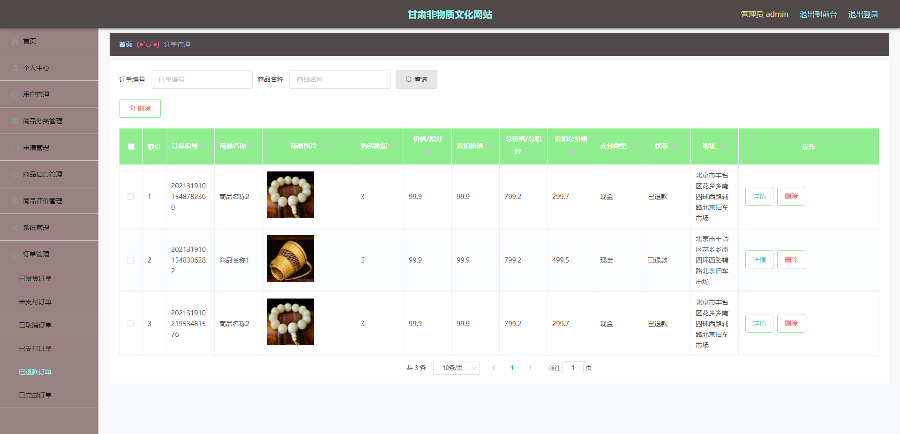

# 基于Springboot的甘肃非物质文化网站

## Springboot-0030


## 技术栈

Springboot mybatisplus vue mysql maven


## 数据库表(16张)


## 功能介绍

```properties
管理员:
用户信息管理,商品分类管理,申请信息管理,商品信息管理,商品评论管理,订单信息管理.

用户:
注册登录
商品查看和购买,加入购物车, 传承人查看,非物质文化信息查看.个人信息修改
```


## 图片

### 前台


### 


### 后台





## 访问路径

### 前台

```properties
http://localhost:8080/feiwuzhiwenhua/front/pages/login/login.html

账号 111
密码 111
```

### 后台

```properties
http://localhost:8080/feiwuzhiwenhua/admin/dist/index.html#/login

账号 abo
密码 abo
```


## 功能图


## 文档目录


## 打赏或交流


